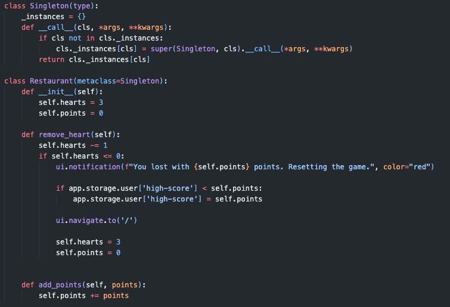

# Course Work
 OOP Coursework. VILNIUS TECH.

## Restaurant Tycoon
### Dependencies
- NiceGUI (Web GUI) `pip install nicegui`
- Faker (For fake name generation) `pip install faker`

### Idea
Thrilling restaurant management game where you'll immerse yourself in the fast-paced world of culinary chaos! In this web-based adventure developed in Python, you'll step into the shoes of a restaurant manager, tasked with handling orders and delivering delectable dishes to eager customers within strict time limits.
 
### How to run?
You can clone the repository, install the necessary dependencies and run `python main.py`. It will launch a local server at 127.0.0.1:8080 (or similar port).

### How to play?
When launching the game, you will see a side-menu and a main-menu in the middle. On the side-menu, there are two buttons - kitchen and inventory. Above them you see your points and lives. If you click the the kitchen button, you will see your available foods you can cook. They take time, and you can only cook one food at the time, so think twice before starting to cook. In your inventory, the cooked foods come up, here you can deliver them to customers who want them.

## The 4 pillars of OOP, their meaning and usage in the code.
### Polymorphism and Inheritance
In this section of code, we have a case of polymorphism, where we create a abstract class called CustomerCreator, and seperate RegularCustomer and VIPCustomer classes. They do the same thing, but some attributes and methods are different between them. This helps us implement different customers with different behavior. Also in the Customer classes mentioned above, we have a case of inheritance. When creating a VIPCustomer and a RegularCustomer, we don't really want seperate card-drawing or dialogue-creating mechanisms, so we instead inherit from the parent class CustomerCreator and this helps us share methods and attributes between the seperate child classes.

### Abstraction
When creating the customer mechanism, it was a challenge to create multiple types of customers. Abstract Base Class method helped me achieve the results I've wanted. It allows us to create sort of like a template of a customer, which then has derived child classes to a certain type of customer, allowing us to not only implement polymorphsim and inheritance, but also Template Method design pattern.
(See picture above Abstraction)

### Encapsulation
It was a challenge to implement encapsulation into my game. It was not hard to implement protected access modifiers, since they're just a convention and it doesn't play with the logic of the code. When trying to create private access modifiers I've encountered various problems such as different parts of code not being able to access them outside of the class.

## Design patterns used in the code
### Singleton
In this snippet of the code, we use Singleton object in order to ensure that the restaurant object is created only once. The object itself holds crucial data for the game such as: points, lives and health management. We use a standalone class named Singleton which ensures there is only one instance of the given class created (in this case the Restaurant() object) because we only want one instance of the restaurant created (hence why this is a singular restaurant management game, not multiple restaurants management game).

### Template Method
By implementing Polymorphsim and Inheritance, I also automatically found out the template method in my game. (See picture in Polymorphism and Inheritance). The base class is created as a template for other customer types to customize. To minimize the code usage, the base class of CustomerCreator has RegularCustomer attributes, but VIPCustomer overwrites the attributes and methods. In conclusion, the template method lets us implement unlimited amount of customer types easily without a hassle.

## Reading from and writing to a file.
When creating the game, I had to come up with an idea of how to implement the food and dialogue lists. After deciding to use the JSON format files (because it's easy to parse them in Python), it made my life a whole lot easier. After completing the 'reading from a file' functional requirement, I had to come up with an idea of what to write in a file. The library I am using for the GUI (NiceGUI) has a nice built-in feature of persistant storage in the browser and it allows me to write the high-score of a player inside the browsers storage.

## Testing

## Code Style
The code style is following the PEP8 style guidelines.

## Results

## Conclusions